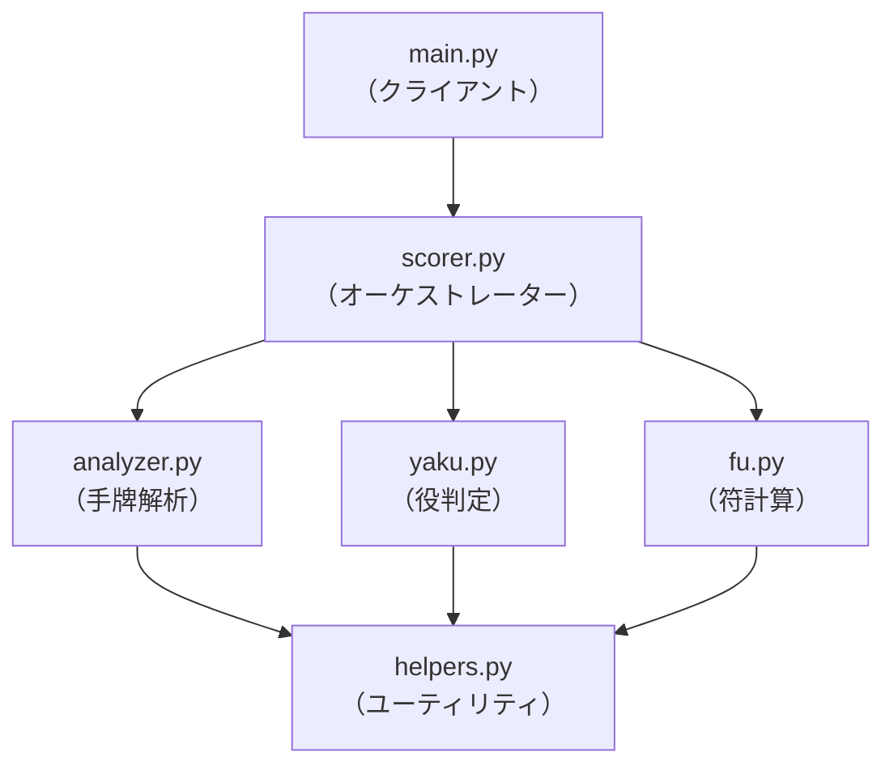

# **麻雀点数計算モジュール 設計書**

## **1. はじめに**

### **1.1. 本書の目的**

本書は、麻雀の点数計算を行うPythonモジュール群の外部委託開発における仕様を定義するものである。各モジュールの責務、インターフェース、およびデータ構造を明確にすることで、実装の円滑化を図る。

### **1.2. システム概要**

本システムは、麻雀のアガリ形、鳴き、およびゲーム状況に関する情報を受け取り、役、符、翻数、そして最終的な点数を算出する責務を負う。システムは複数の独立したモジュールで構成され、それぞれが特定の計算ロジックを担当する。

## **2. アーキテクチャ**

### **2.1. 構成図**

各モジュールは以下の依存関係を持つ。`main.py`（クライアント）からの要求は`scorer.py`が受け付け、各専門モジュールに処理を委譲する。

### **2.2. モジュール概要**

| ファイル名      | 主要クラス/関数         | 役割                                         |
| :-------------- | :---------------------- | :------------------------------------------- |
| `scorer.py`     | `MahjongScorer`         | 全体統括（オーケストレーター）と公開APIの提供     |
| `analyzer.py`   | `HandAnalysis`          | 手牌の構造解析（面子・雀頭・待ちの特定）     |
| `yaku.py`       | `check_all_yaku`        | 役の判定ロジック                             |
| `fu.py`         | `calculate_fu`          | 符の計算ロジック                             |
| `helpers.py`    | `Tile`クラス, `Meld`クラス | 共通データモデルとユーティリティ機能の提供     |

-----

## **3. モジュール詳細仕様**

### **3.1. `helpers.py`**

#### **`Tile`クラス**

- **責務**: 牌（1枚）に関する静的な便利機能を提供するユーティリティクラス。
  - **主要メソッド**:
    - `to_normal(tile: str) -> str`: 赤ドラを通常牌の文字列に変換する。
    - `is_yaochu(tile: str) -> bool`: ヤオチュウ牌かどうかを判定する。
    - `next_tile(tile: str) -> str`: ドラ表示牌からドラ牌を返す。
    - 他、`is_jihai`, `sort_key`など。

#### **`Meld`クラス**

- **責務**: 1つの鳴き面子（ポン、チー、カン）の情報を保持するデータモデル。
- **属性**:
  - `meld_type (str)`: `"pon"`, `"chi"`, `"minkan"`, `"ankan"` など。
  - `tiles (list[str])`: 面子を構成する牌のリスト。例: `["1m", "1m", "1m"]`。

-----

### **3.2. `analyzer.py`**

#### **`HandAnalysis`クラス**

- **責務**: 手牌の構造を解析し、考えられる全ての面子・雀頭の組み合わせを導出する。
  - **`__init__` メソッド**:
    - `hand (list[str])`: 門前の手牌リスト。
    - `melds (list[Meld])`: `Meld`オブジェクトのリスト。
    - `agari_hai (str)`: アガリ牌。
- **公開属性**:
  - `agari_combinations (list[dict])`: 解析結果。詳細は「4.1. 解析結果辞書」を参照。

-----

### **3.3. `yaku.py`**

#### **`check_all_yaku`関数**

- **責務**: 手牌の解析結果とゲーム状況に基づき、成立する全ての役を判定する。
- **引数**:
  - `analysis (dict)`: `HandAnalysis`が生成した単一の解析結果辞書。
  - `melds (list[Meld])`: 鳴き面子のリスト。
  - `game_state (dict)`: リーチ、ツモ、場風などを含むゲーム状況。
- **返り値**: `tuple[dict, int]`
  - 第1要素: 成立役と翻数の辞書。例: `{"リーチ": 1, "平和": 1}`。
  - 第2要素: ドラを除いた合計翻数。

-----

### **3.4. `fu.py`**

#### **`calculate_fu`関数**

- **責務**: 手牌の解析結果と成立役に基づき、符を計算する。
- **引数**:
  - `analysis (dict)`: `HandAnalysis`が生成した単一の解析結果辞書。
  - `melds (list[Meld])`: 鳴き面子のリスト。
  - `found_yaku (dict)`: `check_all_yaku`が返した成立役の辞書。
  - `game_state (dict)`: ゲーム状況。
- **返り値**: `int`
  - 最終的な符（10の倍数に切り上げ済み）。

-----

### **3.5. `scorer.py`**

#### **`MahjongScorer`クラス**

- **責務**: 点数計算機能の唯一の公開インターフェース。各モジュールを呼び出し、最終的な点数を算出する。
- **`__init__` メソッド**:
  - `hand (list[str])`: 門前の手牌リスト。
  - `melds (list[Meld])`: `Meld`オブジェクトのリスト。
  - `agari_hai (str)`: アガリ牌。
  - `**game_state`: キーワード引数として渡される全てのゲーム状況。
    - **必須キー**: `is_tsumo`, `is_oya`, `dora_indicators`, `bakaze`, `jikaze`。
    - **任意キー**: `is_reach`, `ura_dora_indicators`, `is_ippatsu` など。
- **`calculate` メソッド**:
  - **引数**: なし。
  - **返り値**: `dict`
    - 最終的な計算結果。詳細は「4.2. 最終スコア辞書」を参照。

-----

## **4. 主要データ構造定義**

### **4.1. 解析結果辞書 (`analysis` Dictionary)**

`HandAnalysis`が生成する、手牌の1つの解釈パターンを表す辞書。

| キー     | 型                  | 説明                                     |
| :------- | :------------------ | :--------------------------------------- |
| `type`   | `str`               | `"normal"`, `"chitoi"`, `"kokushi"` のいずれか。 |
| `janto`  | `list[str]`         | 雀頭の牌リスト。例: `["1m", "1m"]`。     |
| `mentsu` | `list[list[str]]`   | **門前の**面子のリスト。鳴き面子は含まない。 |
| `machi`  | `str`               | `"ryanmen"`, `"kanchan"` などの待ちの形。    |

### **4.2. 最終スコア辞書 (Final Score Dictionary)**

`MahjongScorer.calculate`が返す、最終的な計算結果を表す辞書。

| キー         | 型     | 説明                                      |
| :----------- | :----- | :---------------------------------------- |
| `yaku`       | `dict` | 成立役と翻数の辞書（ドラも含む）。           |
| `han`        | `int`  | 合計翻数。                                |
| `fu`         | `int`  | 符。                                      |
| `score`      | `dict` | 点数の支払い情報。例: `{"total": 8000, ...}`。 |
| `score_name` | `str`  | 点数名。「満貫」「3翻40符」など。          |
| `error`      | `str`  | エラー発生時にエラーメッセージを格納（任意）。 |